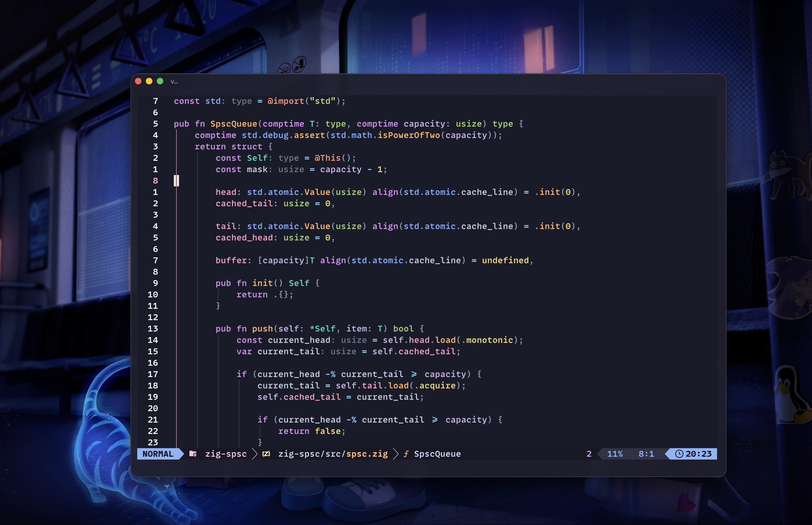

# dotfiles · Personal Developer Platform

面向 C/C++、Rust、Zig、Python 与 Go 的个人终端开发环境。用 chezmoi 管理配置，在 macOS、Linux 与 Dev Container 之间保持一致的 Shell、编辑器与开发工作流。

[效果预览](#效果预览) · [开始使用](#开始使用) · [日常工作流](#日常工作流) · [工具归属](#工具归属) · [配置与维护手册](docs/operations.md)

## 效果预览



*2026-09-13 本机实拍：macOS · Ghostty · Neovim · Zig / ZLS。截图采用[关键字紫色、命名空间蓝色的本机预览（PR #63）](https://github.com/snkio027/dotfiles/pull/63)，不代表该预览已合入主线。*

MonoLisa 为用户自行安装的授权字体，字号 `17.5` 是本机显示设置下的个人选择，不是跨设备推荐值；仓库不分发 MonoLisa 字体文件或桌面壁纸。其他机器的字体、缩放与显示设置会影响实际观感。

## 这套配置关注什么

- **少打断的终端**：Zsh、Starship 与 Atuin；提示符聚焦目录、Git 和异常反馈，历史检索只回填命令，执行前仍可复核。
- **连贯的编辑体验**：Neovim / LazyVim、Blink、LuaSnip、Snacks Picker；导航、补全、片段与检索在同一编辑器完成。
- **统一的开发入口**：构建任务交给 Overseer，测试交给 Neotest，调试使用 nvim-dap / nvim-dap-view，Git 使用 LazyGit 与 Octo。
- **明确的颜色职责**：Catppuccin Mocha 宿主 + DX E 源码投影；语义角色与 RGB 分开验证，不靠“颜色不同”证明身份正确。
- **可审查的更新**：配置、插件锁与工具归属纳入 Git；日常 apply 不主动批量升级工具，Neovim 更新先进入隔离候选环境。

## 开始使用

这是个人工作站配置，不是无副作用的主题安装包。部署前请阅读[初始化与平台边界](docs/operations.md#初始化)及 [SSH 与提交签名](docs/operations.md#ssh-与提交签名)。

初始化和 apply 会安装缺失依赖、配置 Git / SSH 与 hooks；macOS 还会应用系统偏好。请先检查现有配置、身份信息、字体和功能开关，尤其是 `home/.chezmoiscripts/` 中的脚本。

已有 chezmoi 时，分步检查并部署：

```bash
chezmoi init https://github.com/snkio027/dotfiles
chezmoi diff
chezmoi apply
```

`chezmoi diff` 展示目标文件差异，不能代替对脚本副作用的审核。仅想查看配置时，克隆仓库即可，不必运行 apply。

| 平台 | 管理范围 | 不包含 |
| --- | --- | --- |
| macOS 工作站 | Shell、CLI、Neovim、Ghostty、GUI 与系统偏好 | 授权 MonoLisa 字体文件 |
| Linux 工作站 | Linuxbrew、Shell、CLI、Neovim、Zellij 与 TUI | Ghostty 安装、桌面快捷键与 macOS GUI |
| Dev Container | Linux 工具链、Shell、Neovim 与项目开发环境 | 宿主密钥生成、宿主 Git hooks 与 macOS 偏好 |

Linux 保留已有终端模拟器；安装 Zsh 不会自动修改登录 Shell。容器使用独立 profile，具体安装与验证边界见[维护手册](docs/operations.md#初始化)。

## 日常工作流

Neovim 的 `<leader>` 是空格。macOS 的 `Cmd` 绑定属于 Ghostty；Shell、Neovim 与 Zellij 的 `Ctrl / Alt` 绑定见[完整快捷键表](docs/operations.md#功能与快捷键速查)。

| 想做什么 | 入口 |
| --- | --- |
| 进入项目 / 查历史 | `z <keyword>` · `Ctrl-R` |
| 浏览文件 / 查看 Git | `y`（Yazi，退出后进入目录）· `lg`（LazyGit） |
| 查文件 / 搜项目 | Neovim `<leader><space>` · `<leader>/` |
| 查引用 / 重命名 / Code Action | `grr` · `grn` · `gra` |
| 运行任务 / 最近测试 | `<leader>oo` · `<leader>tr` |
| 设置断点 / 开始或继续调试 | `<leader>db` · `<leader>dc` |
| 阅读 / 预览 Markdown | `<leader>um` · `<leader>cp` |
| 检查环境 / 审核配置差异 | `devdoctor` · `chezmoi diff` |

### 多语言支持

| 语言 | 语义、检查与格式化 | 构建、测试与调试 |
| --- | --- | --- |
| C/C++ | clangd、clang-tidy、clang-format | cxx-init、CMake、Ninja、CTest、codelldb |
| Rust | rust-analyzer、rustaceanvim、rustfmt、Clippy | Cargo、Neotest、codelldb |
| Zig | ZLS、`zig fmt` | `zig build test`、Neotest、codelldb |
| Python | uv、Ty、Ruff | pytest、Neotest、debugpy |
| Go | gopls、gofumpt、goimports、golangci-lint | `go test`、Neotest、Delve |

C++ 项目使用 `cxx init hello` 创建，再运行 `cmake --workflow --preset dev` 生成构建产物与 clangd 编译数据库。Python 项目先运行 `uv sync`；Neovim 会把项目环境统一交给语言服务、测试与调试。详见[多语言工作流](docs/operations.md#多语言开发环境)。

## 工具归属

| 管理者 | 职责 |
| --- | --- |
| chezmoi | 部署配置与显式的初始化 / 迁移脚本 |
| Homebrew / Linuxbrew | 通用 CLI、非 Rust 全局 Runtime、构建工具与 rustup 管理器 |
| rustup | Rust 编译工具链、组件与 targets；尊重项目 `rust-toolchain.toml` |
| uv | 项目 Python、虚拟环境与依赖；隔离安装 Python CLI（cxx-init） |
| lazy.nvim | 恢复已提交的 Neovim 插件锁 |
| Mason | 编辑器专用工具；Brew LLVM 的 clangd / clang-format、Brew rust-analyzer 保持独立归属 |

[brew/ownership.toml](brew/ownership.toml) 是工具归属的唯一来源，生成 `core / workstation / devcontainer / quality` 四个 profile。不使用 mise、asdf、nvm 或 pyenv；项目版本声明与依赖锁仍由项目维护。

### 配置与更新分开

```bash
devdoctor                     # 只读诊断环境与工具来源
chezmoi diff                  # 先审核配置差异
chezmoi apply                 # 部署配置、安装缺失依赖；不主动批量升级
brewup                        # 显式更新、升级并清理 Homebrew
rustup update stable          # 显式更新 Rust stable 工具链
devup                         # 创建独立 Neovim 更新候选；不改日用环境
```

更新候选通过 smoke 不等于完整 CI 或真实交互验收，也不会自动成为日用配置。[候选体验、采用与放弃流程](docs/operations.md#neovim-隔离更新候选)单独说明。

## 仓库导航与验证

```text
home/                  chezmoi source state；唯一映射到用户 HOME 的目录
brew/                  工具所有权、生成器与安装 profiles
.devcontainer/         容器镜像与启动流程
fonts/ · icons/        字体特性清单与跨工具图标契约
tests/                 Shell、模板、编辑器、字体与工具链行为验证
scripts/               Rust provisioning、CI 分类与供应链校验
docs/                  操作手册与实机效果图；不部署到日用目录
```

[GitHub Actions](https://github.com/snkio027/dotfiles/actions/workflows/ci.yml) 按变更路径选择已有门禁：模板与 Shell 检查、安装 profile、macOS 渲染、Locked Neovim Cold Start 和 Dev Container Lifecycle。被跳过的任务不算已执行；CI 通过也不替代实机的视觉、字体与交互验收。

- [配置与维护手册](docs/operations.md)：完整目录、XDG、快捷键、Rust / Neovim 更新、SSH 与恢复边界。
- [E 视觉迁移记录](tests/nvim/E-VISUAL-MIGRATION.md)：源码色、UI 保留项与验收证据。
- [历史视觉研究恢复](docs/operations.md#历史视觉研究恢复)：从固定 Git 提交导出到独立归档，不覆盖工作区。
